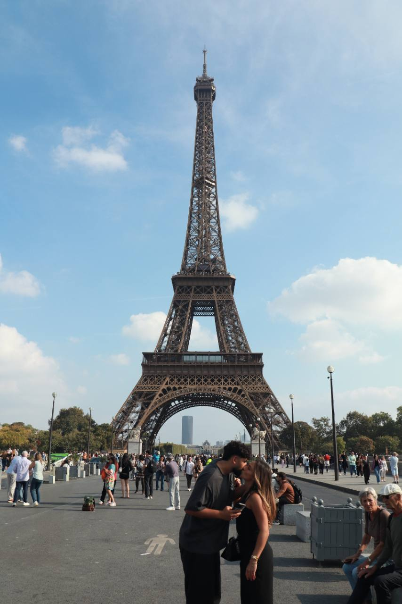
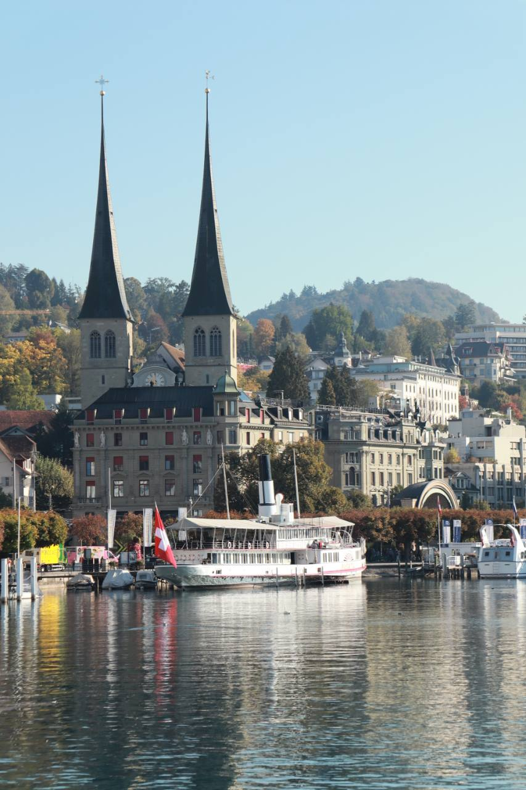
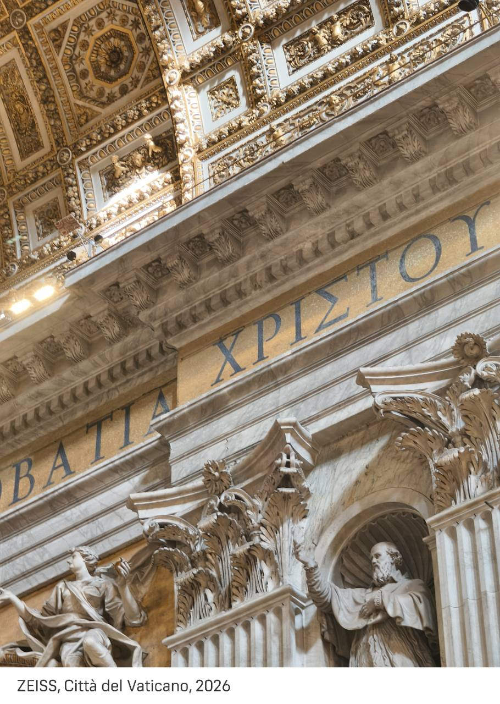
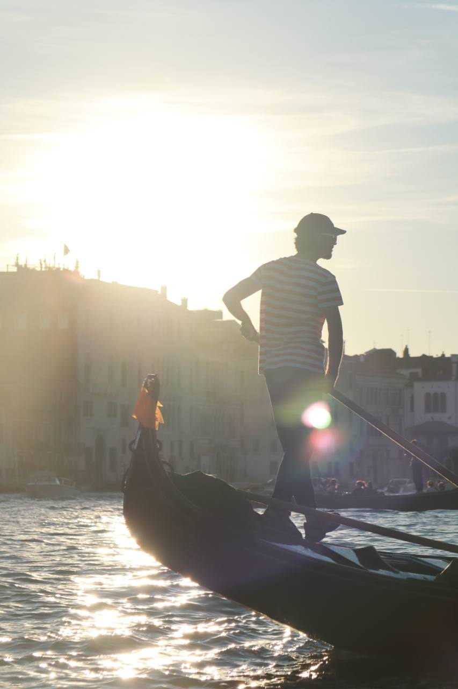
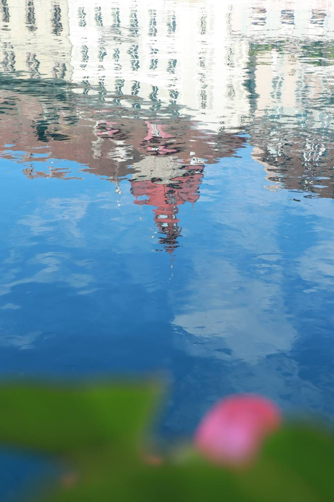
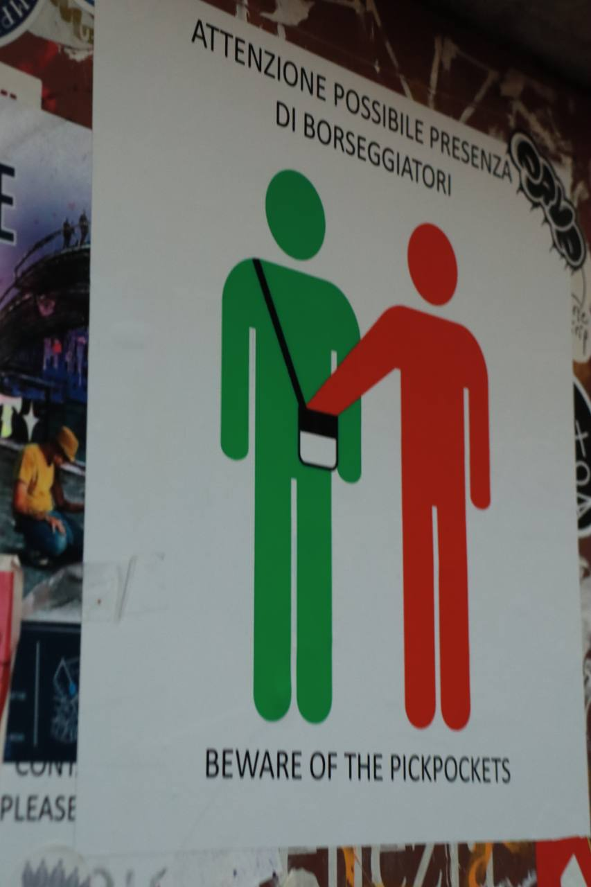

今年趁着“请3休13”，和女朋友去了一趟欧洲。（写到这里的时候还是女朋友，过几天就是老婆了。）

9月26日凌晨从北京出发，飞到布鲁塞尔，之后经过法国、瑞士、奥地利、德国、意大利，最后从罗马返程，10月6日下午落地北京。同行的是一位东北领队、一位匈牙利司机，还有另外28位团友。

这次报的是十天的经济团，每人22000元。选的时候看下来，这算是同类团里比较标准的价格，大致是平时19000，再加节假日的3000。不同团根据行程和吃住水平，价格在这个数字上下浮动。大部分行程比较固定，也比较赶，没有太多自由活动的时间。我觉得这趟是值的，第一次去欧洲，先当个“踩点”挺合适。

从朋友圈点进来的朋友，我这次拍到了一些自己喜欢的照片，不知道有没有让大家也想去欧洲玩。如果有，可以看看下面的经历和吐槽，再考虑要不要去，哈哈。

<figure>

<figcaption>巴黎，随处可见的热吻的情侣。</figcaption>
</figure>

## 风景和意外之喜

瑞士这段是我一路下来最喜欢的，尤其是因特拉肯和迈林根。很安静，很有我想象中那种“欧洲”的感觉，游客和当地人的素质也高。伯尔尼和卢塞恩同样让我喜欢，城市整洁，秩序也好。

<figure>

<figcaption>卢塞恩，水边的城市和游船。</figcaption>
</figure>

瑞士的自然景色也很惊人，像是到了油画里的世界。除了物价高一点，待着都挺舒服。

这趟还因为行程出了岔子，多看了一遍瑞士的风景。

先是司机开错了路，后面又出了个火车上的插曲。我们坐金色山口火车从卢塞恩到迈林根，下车后集合、上厕所。外面的厕所要排队，领队就让两位团友去火车上解决，结果搞错了发车时间，两个人还在车上，车开走了。

这两件事导致行程临时调整，我们又坐了一趟从迈林根返回卢塞恩的金色山口火车，把沿途美景再欣赏了一遍。后面还补偿了卢塞恩湖的游船，30人包船，含中文讲解，具体多少钱不知道，但估计价值不菲。

法国的卢浮宫，还有意大利的佛罗伦萨和罗马，跟着讲解逛下来，又简单复习了一遍欧洲的历史和人文。这几段游览拍到的照片我也很满意。

<figure>

<figcaption>圣彼得大教堂，建筑细节。</figcaption>
</figure>

这趟还有两次很巧的偶遇。

落地布鲁塞尔那天，我发了条朋友圈，结果一个在瑞典工作的老同学刚好也在布鲁塞尔旅游，就住在我接下来要去的撒尿小童附近。我们就约着见了一面，一起吃了薯条，还在布鲁塞尔大广场（Grand-Place）合了影。

到了威尼斯，又在街道上迎面碰见了正在自由行的大学同学，也是我和女朋友的好友。当时刚好没玩手机，抬头的那一秒就看见并认出了对方，实在太巧了。

## 司机和英语交流

司机也是这趟旅行里让我印象挺好的一位。匈牙利人，大概五十三岁，会说英语，每天见面都会和我们打招呼。一路下来任劳任怨，人也很好。

有一次下车，我女票和另一位团友的父亲都把手机落在了车上。我为了帮他们取手机，走了好几分钟，到停车场找到大巴，结果还顺便参与了一场关于停车位和停车费的讨论。

司机会英语，我用蹩脚的英语跟着聊，停车场看守人却只会意大利语。一个匈牙利人、一个中国人、一个意大利人，就这么凑在一起研究停车的事，倒也蛮有意思的。

<figure>

<figcaption>威尼斯，贡多拉船摇橹人。</figcaption>
</figure>

以前听人说南欧人比较热情。在意大利点餐时，我搞错了收银的位置，旁边四五个本地人突然一起给我指应该在哪里付钱。一下子这么多人帮忙，还挺热情的。

说到语言，我上学的时候英语读写能力还行，但听力和口语都比较差，尤其是口语。多邻国英语也才学到37分，学的都是基础的日常表达。

实际落地以后发现，平时常用的那些英语口语，加上肢体语言，再拿手机拍东西给对方看，感觉就够应付95%的问路、点单场景了。句子说得不完整也没关系，让对方明白自己想去哪、想吃什么，就够用了。

词汇也不用太怕。有一次在意大利，帮家人问想买的衣服，官网上标的颜色是“ivory”，也就是象牙白。我拿图片给导购看，对方问我是不是要“beige”，我没听懂，就掏出Google翻译，请对方把词敲进去，这才知道对方说的是米色。

回头想想，多邻国里那些看着非常“无聊”的英语练习，问路、点单、买东西，出门还真用得上。认真记住了，很多场景都能应付。

想出去玩、又因为英语不太好而不敢出发的朋友，也不用太担心。我这样的口语都能问路点餐，听不懂就拿翻译工具出来。以前练口语总有点怵，这次反而有了兴趣和信心，想再多学一点，跟人聊得更顺一些。

还有个非常关键的功臣，差点忘了写：ChatGPT老师。一路上查当地问候语、查习俗、查历史沿革，甚至查领队说的到底是不是真的，都没少用。听讲解时冒出个问题，或者碰到什么不懂的，拿手机问一下，旅行中随时有人答疑的感觉很好。

在欧洲用当地的网络，还能直接爽用，不用多一步“魔法上网”。且这些用途，免费版应该就够用。

这一路还跟着ChatGPT学了几句当地的问候和感谢。当地人看到一个亚洲面孔开口说这些话，发音还挺准，大多数都会露出惊讶又高兴的表情。看ta们的反应，非常有意思。有些词我只记住了声音，下面结合AI和词典，把这些常用表达的拼写、意思和IPA音标整理了一下：

| 语言／地区 | 表达 | 意思 | IPA音标 | 中文近似读音 |
|---|---|---|---|---|
| 法语 | [bonjour](https://en.wiktionary.org/wiki/bonjour#French) | 你好／日安 | [bɔ̃ʒuʁ] | 邦茹尔 |
| 法语 | [bonsoir](https://en.wiktionary.org/wiki/bonsoir) | 晚上好 | [bɔ̃swaʁ] | 邦斯瓦尔 |
| 法语 | [merci](https://en.wiktionary.org/wiki/merci#French) | 谢谢 | [mɛʁsi] | 梅尔西 |
| 法语 | [salut](https://www.larousse.fr/dictionnaires/college/salut/36020) | 你好／再见（随意的说法） | [saly] | 萨吕 |
| 瑞士德语（伯尔尼一带） | [Grüessech](https://de.wikipedia.org/wiki/Schweizerdeutsch) | 您好 | [ˈɡryəsːəx] | 格吕诶瑟赫 |
| 瑞士德语 | [merci](https://en.wiktionary.org/wiki/merci#Alemannic_German) | 谢谢 | [ˈmɛrsi] | 梅尔西 |
| 德语（德国南部、奥地利常用） | [Grüß Gott](https://en.wiktionary.org/wiki/gr%C3%BC%C3%9F_Gott) | 您好 | [ɡʁyːs ɡɔt] | 格吕斯·戈特 |
| 德语 | [danke](https://en.wiktionary.org/wiki/danke#German) | 谢谢 | [ˈdaŋkə] | 当克 |
| 意大利语 | [ciao](https://en.wiktionary.org/wiki/ciao#Italian) | 你好／再见（随意的说法） | [ˈtʃao] | 乔 |
| 意大利语 | [grazie](https://en.wiktionary.org/wiki/grazie#Italian) | 谢谢 | [ˈɡrattsje] | 格拉齐耶 |
| 意大利语 | [ciao ciao](https://en.wiktionary.org/wiki/ciao_ciao) | 拜拜 | [ˈtʃao ˈtʃao] | 乔乔 |
| 匈牙利语 | [köszönöm](https://en.wiktionary.org/wiki/k%C3%B6sz%C3%B6n%C3%B6m) | 谢谢 | [ˈkøsønøm] | 科瑟讷姆 |
| 匈牙利语 | [köszönöm szépen](https://en.wiktionary.org/wiki/k%C3%B6sz%C3%B6n%C3%B6m_sz%C3%A9pen) | 非常感谢 | [ˈkøsønøm seːpɛn] | 科瑟讷姆·塞潘 |

<figure>

<figcaption>卢塞恩，油画般的建筑倒影。</figcaption>
</figure>

## 同行的团友

团里的人性格各异，出来玩的诉求也差得挺多。有独行的，有带父母出来玩的，有希望向导多讲点东西的，也有希望向导少说话的；有人想玩得更深一点，有人想多打卡几个地方；有人到哪都购物，也有人啥都不买。

聊天的话题也是，奢侈品生态、欧洲历史、明星八卦，都能聊。团里有几位40岁左右的姐姐，还有一对大概34岁的夫妻，突出一个和谁都能聊起来，什么话题都能接上。

有一位03年的团友，应该刚毕业不久，到哪都惦记着三件事：吃什么，有没有地方抽烟，哪里能买大流量卡刷抖音。算是团里的一个活宝。还有一位“高饱和度”战士，照片风格很鲜明，也很乐意帮其他团友拍照。

还有位团友，人很热心，就是有时太着急。出境时刚过完安检，就在群里说已经“过关”。我们团签要求出关盖章，几个人还没走到海关，以为漏了手续，一下就慌了。

有些团友也让人头疼。为了拍照好看摘下向导耳机，然后掉队；点名不答“到”；大群明明说好主要发通知，还是不断刷“收到”、闲聊、发照片。类似的事一路没少发生。

跟团游一路急哄哄的，有时候连最基本的规矩都顾不上。在比萨坐公交车，车刚进站，团里的人没管其他乘客，直接一拥而上。公交司机站起来，大声教训：“难道你们中国没有先下后上的规矩吗？”那一刻我无奈又羞愧。

13组的一位团员也让人无语。事先已经被提醒过，火车只停40秒，不要下车拍照。结果ta还是下去了，错过一部分行程，也让领队额外费了不少心。

最让我无语的还是那个八人小圈子，包括4、8、9、10、15组的部分团员。ta们落地第一时间一起找地方抽烟，就这么认识了，后面一直臭味相投。四个核心人物，另外四个跟着ta们活动。主要诉求是出片，而且要拍出那种很悠闲、看不出来是在跟团游的照片。

ta们会要求去某些地方拍照，安排不了，就想办法脱团自己去。十天里至少出现了五次，比如在巴黎打车去看日落。到了比萨，又因为拍照机位和其他中国游客发生了一场比较激烈的争吵（这次是对方有错在先）。再到罗马，出了地铁就美美隐身，去找网红机位拍照。

自己出去玩，却耽误大家的行程，还得让领队到处联系，这就很自私了。四个人提要求，八个人一起行动，突出一个“人多力量大”。

后来看到ta们发的照片，也得承认确实很有ins味，没多少普通游客照的感觉。就是苦了等ta们的其他人。

三十个人一起赶十天的行程，团友本身也成了旅行的一部分。大家来自各行各业、各个年龄段，如果不是这次旅行，我估计一辈子都不一定会认识这些人。

## 经济团的吃住和安排

这次吃下来，我觉得意大利比其他几个国家高一头，蔬菜水果相对丰富一些，口味也更合我的胃口。国内吃过萨莉亚的，大概能理解那种比较容易接受的感觉。意大利是我最愿意再多吃几顿的地方。

团餐就差多了。旅行社安排的中餐厅，整体定位比较低，菜做得不如一路吃到的当地西餐馆，更没法和国内的餐馆比。行程紧，想自己另找点好吃的，也不总有机会。

住宿同样得调整预期。这次旅馆价格基本在85～140欧一晚，大多数时候还住在郊区。房间小、设施旧，大部分酒店的卫生也差，有些酒店没空调，拖鞋、牙刷牙膏这些统统没有，瓶装饮用水也不提供，当地人习惯直接喝水龙头里的自来水。有些住处周边环境差，住着也不安心。早餐往往是面包、奶酪、火腿，配咖啡和牛奶，吃几天就开始想念热乎的中式早餐。

到了吃住环节，就知道这个团为什么叫“经济团”了。

除了合同里的行程，领队所在的公司还提供了五个加项，全部参加大约每人360欧元。自愿报名，每项超过半数报名就加，顺路去一些合同之外的地方，公司想多赚点钱，这个我多少可以理解。不过领队东北大姐讲话直，容易得罪人，有团员觉得是乱收费、强制收费，当晚就举报了她，团里也多了些对抗情绪。

## 打工人羡慕 游客着急

这次经过的几个国家，去的基本都是大城市或者旅游热点。一路下来，感觉各种店铺开门都挺晚。

在布鲁塞尔碰到的一家炸物店，上午10点开门。我9点58分进去，看着已经完全准备好了，结果店员说还没到营业时间，让我出去等到10点。

也就差两分钟，非得出去等，当时真挺无语的。

到意大利的第一天，上午刚经历过铁路大罢工，我们下午坐火车，感觉客流量特别大，现场秩序也有点混乱。列车原定19:34发车，我印象里直到19:31左右才公布上车站台。离发车只剩三分钟，最后也不出意外地晚点了。

这次还知道了一个专门查意大利各组织罢工日历的微信小程序。出门除了看天气、查路线，还得看看今天有没有人罢工。意大利交通部门也有公开的[交通罢工日历](https://scioperi.mit.gov.it/mit2/public/scioperi)。

不过，劳动者能通过罢工争取自己的权益，这件事本身我就觉得很先进。作为一个在国内上班的人，很难不羡慕。

回来之后，我还专门查了各国的年平均工作时长。按[Our World in Data收录的2023年数据](https://ourworldindata.org/grapher/annual-working-hours-per-worker)，中国每位就业者年均工作约2328小时，在有数据的129个国家里排第15。法国约1487小时、瑞士1529小时、奥地利1439小时、德国1335小时，都比中国少三分之一以上。

（这个平均数包含兼职、自雇等就业形式，不能理解成每个同岗位的人都少上这么多班。）少上班，多一点属于自己的时间，谁不想呢。

在佛罗伦萨听文艺复兴的历史，让我想起这一路看到的劳动者待遇。以前读到人文主义、马克思对劳动的讨论，更多是在书本上。这次看到个人时间有明确的边界，劳动者可以通过罢工争取权益，倒觉得这些思想离日常生活也没那么远。

[八小时工作制曾是国际工会运动的主要诉求之一](https://www.ilo.org/resource/article/convention-no-1-landmark-workers%E2%80%99-rights)。我觉得对人的尊重，也包括让人能休息，能拒绝，能争取更好的待遇。

只是轮到自己在车站等车、在店门口等开门的时候，又难免着急。作为打工人的我有多向往，作为游客的我就有多不爽。

## 交通和治安

还有一个和国内很不一样的地方，是安检。

这次经过的火车站、地铁站都没有安检，感觉就像大巴站一样，直接进去坐车。在意大利罗马的机场，安检也宽松不少，当时带着水就通过了，也没被要求拆包检查。

习惯了国内坐地铁、坐火车都要把包过一遍机器，到了这边反而有点不适应：这就可以进去了？

治安方面也得多留点心。巴黎的抢夺、罗马的偷盗，小红书上讨论不少，领队一路也反反复复提醒我们注意手机和随身财物。拍照的时候很容易只顾着看屏幕，这些提醒听多了，也会记得多看一眼周围。

在威尼斯街头，我还拍到了一张防扒手提示牌。上面直接画着一个人伸手掏另一个人的包，下面写着“BEWARE OF THE PICKPOCKETS”，也就是“小心扒手”。画得非常直白，连语言障碍都替你省了。

<figure>

<figcaption>威尼斯，街头的防扒手提示牌。</figcaption>
</figure>

欧洲本身也有不少槽点。卢浮宫外墙的尿骚味、塞纳河畔流浪汉的定居点，还有一路反复被提醒的偷盗和抢夺，都在那些漂亮照片之外。公共厕所经常收费，上个厕所还得惦记零钱。再加上国内早就习惯的移动支付、网购、外卖这些便利，到了这边才发现，想随时随地掏个手机就把事情办了，还真没那么容易。出门前觉得这些服务理所当然，出来一趟才知道自己有多依赖它们。

城市面貌和国内差别很大，一路很少看到成片的高楼大厦。老建筑好看，但这次坐过的火车、走过的公路，以及铁路运行和车站信息服务，都没让我觉得比国内先进。尤其习惯了国内的高铁，再碰上临发车才公布站台、列车晚点这些事，很难不怀念国内的方便。

这些都提醒我，欧洲已经不是历史书里一百多年前那个盛极一时的欧洲了。它有让中国打工人羡慕的劳动者保护和个人时间，也有让中国游客皱眉的卫生、治安和公共服务。它和我们各有各的侧重点，也各有各的不堪。

## 下次怎么选

如果是第一次来欧洲，可以把这种团当成一次“踩点”：旅行社负责安排交通、住宿和游览，行程和安全方面有人照应，自己能先看看不同国家，也顺便丰富一下护照本。

但一定要调整预期。吃住差强人意，行程紧，自由时间少，照片拍得好看，实际每天都在赶路。

还有，参加这种团最好找个熟悉的人一起，尽量别一个人报名。旅行社会给单人拼搭子，搭子合不来可就闹心了。我这次见到了三对临时搭子“反目”，比如集合的时候，完全不管另一个人到没到。十天都要一起赶行程，搭子合不来，旅行也不开心。

另外，大团出行还是得充分尊重别人。这次在当地感受到的对个人时间和边界的尊重，我挺喜欢。但自己想怎么玩，也得考虑会不会影响同行的人。三十个人一起走，不能自己的照片要拍好、自由要享受，联系和等待的麻烦全留给别人。

这次对欧洲旅行和当地社会有了基本了解，下次想自由行，挑少数几个自己喜欢的地方，慢慢逛。

最后还要特别鸣谢我女朋友。这趟旅行从决定出发、选团到前期联系，几乎都是她在张罗和撺掇。谢谢她把这次欧洲之行安排起来，也陪我一起看了这些风景。

---

> **AI创作声明：** 本文的旅行经历、照片和观点来自我本人，ChatGPT协助整理初稿、查询和核对资料、润色文字，最后由我通读并修改。
