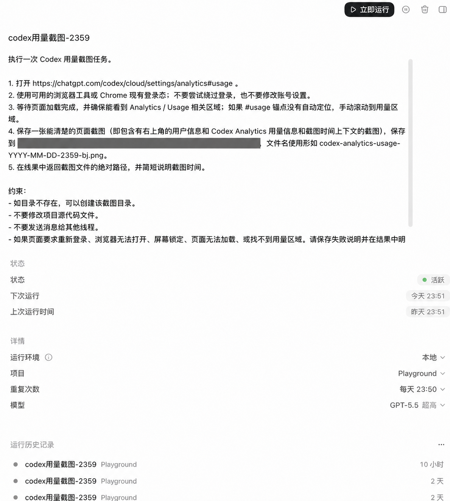
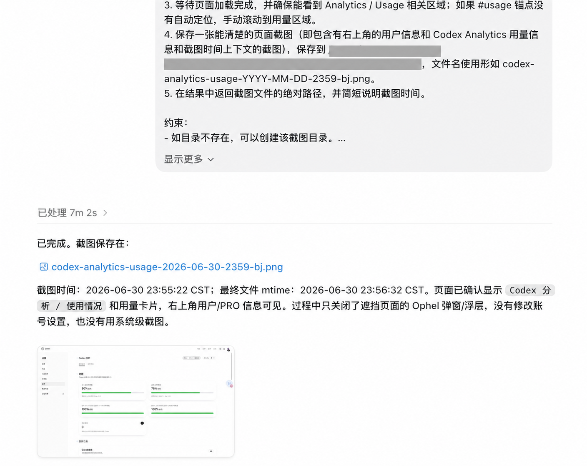
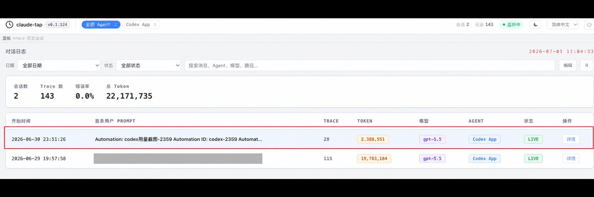
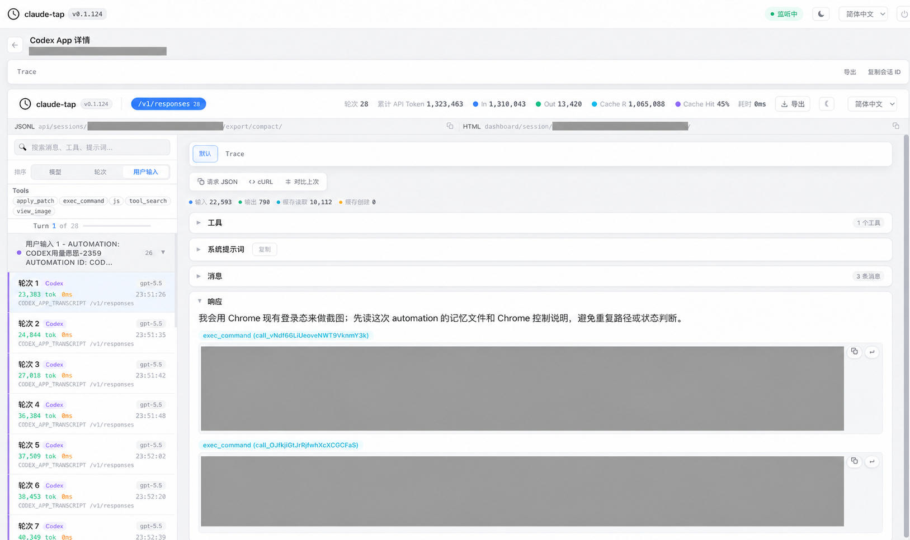
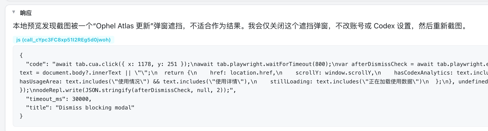
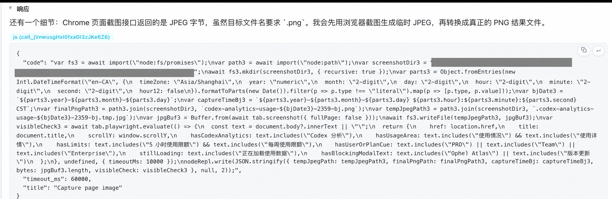
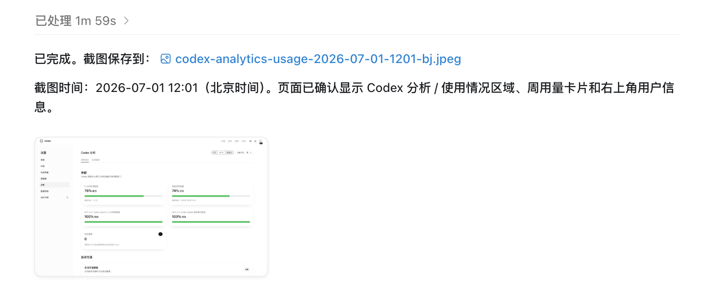
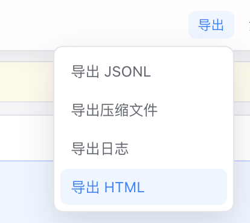

> 本文通过一个例子，实际演示怎样通过 trace 提升 AI 完成任务的效果。

## 背景

报名参加了我司的 token 跑酷大赛，每天需要截图保存一下 Codex Pro 订阅的周 quota 使用了多少。

为了能第一时间保存用量截图，减少人脑负担，~~也为了多增加那么百分之零点几的用量~~，我设置了一个 Codex 定时任务，每天晚上 23:59 自动打开官网，查询周 quota 余量并截图保存。

定时任务设计如下：



简单说，就是连接到浏览器，打开 [Codex Analytics 用量页面](https://chatgpt.com/codex/cloud/settings/analytics#usage)，并保存一张截图。

但是昨天的一次运行非常诡异，如下图：



运行了整整 7 分钟？不太对劲。

还提到了弹窗、浮层之类的字眼。

## 让我用 claude-tap 查查怎么个事

首先安装 [claude-tap](https://github.com/liaohch3/claude-tap)：

```shell
uv tool install claude-tap
```

开启对 Codex App 本地会话的监听，随后 claude-tap 会打开一个 Web UI 工作台：

```shell
claude-tap --tap-client codexapp
```

在想排查的 AI 会话 session 里随便再聊句话，claude-tap 工作台上就能看到该会话的 trace 了。



打开这次会话的**详情**，切换到**完整 Viewer**，排序选择**用户输入**。



当前这个视图可以比较直观地看出来：我的一次输入，被 agent harness 拆成了 28 轮与 LLM 的交互。每一轮处理了多久、输入了多少 token、LLM 的响应是什么，都能看到。

一般来说，可以先**粗略看一遍每一轮 LLM 的响应**，再对重点怀疑的地方查看当轮 messages，做细粒度排查。

粗看下来，我发现了两个问题。

问题 1：Ophel Atlas 的更新弹窗和页面右侧工具浮层，为了关闭弹窗与浮层、给我一张纯净的截图，多折腾了 2 分 55 秒。



问题 2：默认截图是 JPEG 格式，但因为我在 prompt 里要求了 `.png`，做转换和验证又多用了 1 分 10 秒。



## 优化方向就很明显了

1. Ophel Atlas 是一个网页增强插件，我有几种选择：

   - 关闭这个插件。
   - 配置插件，使其在 [Codex Analytics 用量页面](https://chatgpt.com/codex/cloud/settings/analytics#usage) 不生效。
   - 在 prompt 里告诉 AI，不需要把截图搞得太干净；浮层留在旁边也可以，只要不遮挡周用量信息就能接受。
   - 使用 Codex 的内置无头浏览器完成这个工作（需要提前完成一次登录授权），而不是用 connector 连接真实浏览器。

2. prompt 里不再强制要求 `.png` 格式，截图保存成 `.jpeg` 即可。

## 简单优化 prompt 之后的效果

- 时间：7 分 02 秒 → 1 分 59 秒
- tokens：2,388,551 → 1,106,262



## 后话

claude-tap 有导出功能，HTML 格式适合人看，JSONL 等格式适合与 AI 协作分析。



trace 里可能包含 prompt、工具调用、文件路径，甚至业务上下文。导出或分享之前，记得先做一遍脱敏检查。

trace 胜千言，善用导出能力，把现场给到相关同学，对排查问题和提升效果会有很大帮助！
